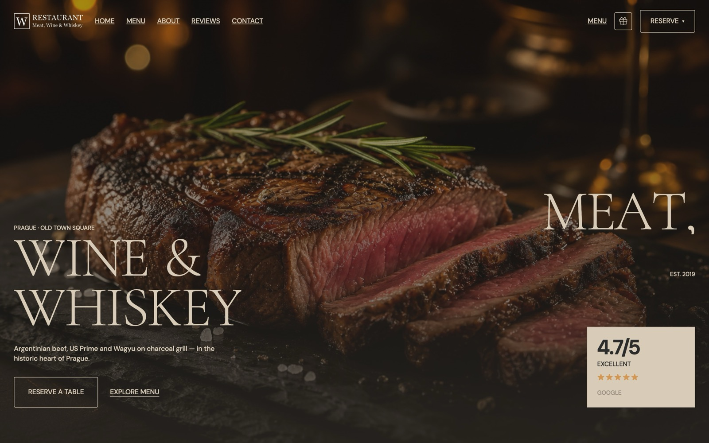
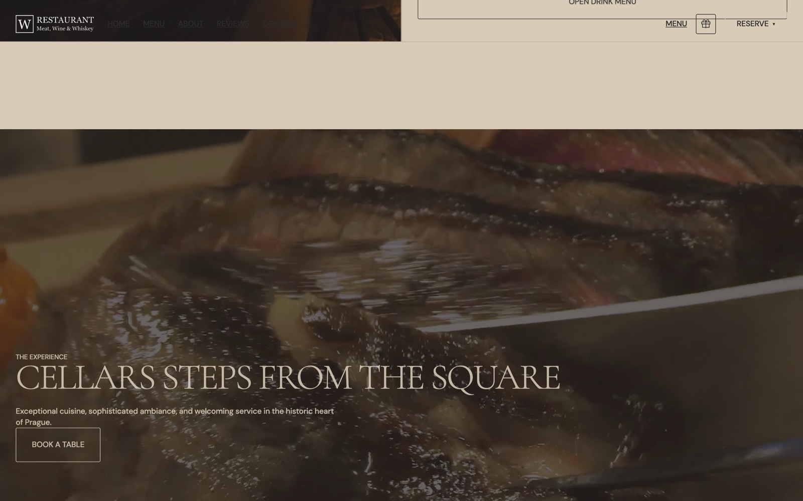
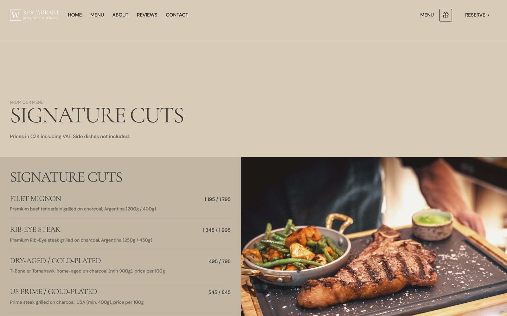
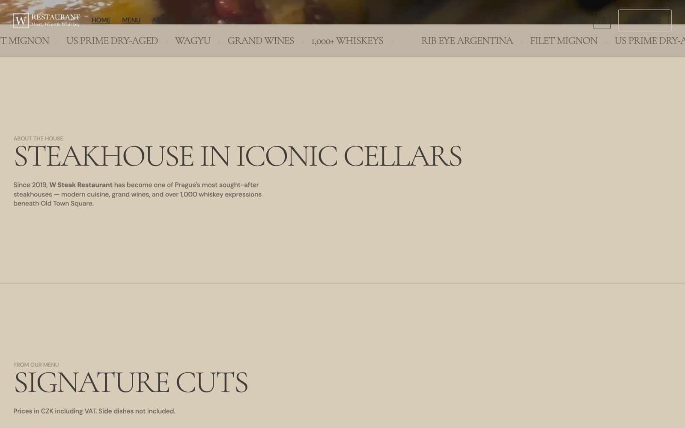
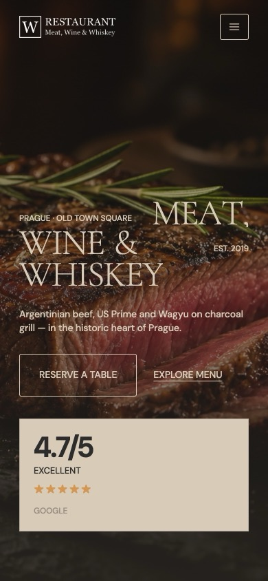

# W Steak Restaurant — Editorial Landing Page (v2)

> **Unofficial redesign concept.** This project is not affiliated with, endorsed by, or maintained by [W Steak Restaurant](https://wrestaurant.cz/) (W Restaurant & Whiskey Bar, Prague).

An **alternative editorial** UI/UX concept for the landing page of **W Steak Restaurant — Meat, Wine & Whiskey**, built as a second portfolio exploration alongside the [original dark & gold concept](https://github.com/Zirvey/w-steak-restaurant-landing-page).

---

## Preview

<video src="docs/preview-hero.mp4" controls muted playsinline width="100%"></video>

Hero entrance, then scroll to the grill atmosphere section. Stills below are from **this editorial (v2) site only**.

### Desktop

| Hero | Experience |
|:---:|:---:|
|  |  |

| Menu | About |
|:---:|:---:|
|  |  |

### Mobile

---

## About this project

This repository contains a **non-production, unofficial** front-end concept that reimagines the public landing experience for [wrestaurant.cz](https://wrestaurant.cz/) with a warm editorial visual language — parchment canvas, saffron accent, sharp edges.

| | |
|---|---|
| **Purpose** | UI/UX redesign study & portfolio showcase (alternative direction) |
| **Status** | Concept / demo only |
| **Sibling concept** | [w-steak-restaurant-landing-page](https://github.com/Zirvey/w-steak-restaurant-landing-page) (dark & gold) |
| **Official website** | [wrestaurant.cz](https://wrestaurant.cz/) |
| **Reservations** | [wrestaurant.cz/book-a-table](https://wrestaurant.cz/book-a-table) |

Content (copy, menu prices, imagery, logo) is sourced from the official website for demonstration purposes. All restaurant branding and trademarks belong to their respective owners.

---

## Features

- **Editorial parchment & saffron** visual language
- **Full-bleed dark hero** with typography entrance and steak still
- **Atmosphere video** sections (grill / cut) with reduced-motion fallbacks
- **Marquee** dish-name scroll
- **Menu highlights** with pricing from the official menu
- **Sharp cards**, ghost outlined buttons, hairline dividers
- **Fully responsive** layout (mobile → desktop)

### Visual direction

- **Typography:** Cormorant Garamond + DM Sans
- **Palette:** `#d8cbb8` · `#d49653` · `#2c2c2c`

---

## Disclaimer

This is a **personal design concept**. It must not be presented as the official website of W Steak Restaurant. For real bookings, menu, and events always use [wrestaurant.cz](https://wrestaurant.cz/).

See [DISCLAIMER.md](DISCLAIMER.md) for the full legal notice.

---

## Third-party content

Logo, photography, menu data, and brand elements are property of W Steak Restaurant / wrestaurant.cz. See [NOTICE.md](NOTICE.md).

---

## Author

**Zirvey** · [temirlankakishev@gmail.com](mailto:temirlankakishev@gmail.com)

---

## License

Source code in this repository is licensed under the [MIT License](LICENSE).

Third-party brand assets and content are **not** covered by this license. See [NOTICE.md](NOTICE.md).
